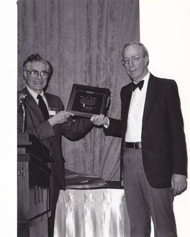

The 15th Technical Symposium was held February 16-17, 1984 in
Philadelphia, PA at the Franklin Plaza Hotel. The Chair was Richard H.
Austing (University of Maryland). Joyce Currie Little (Towson State
University) served as the Refereed Papers Chair and Lillian N. Cassel
(Goldey Beacom College) served as the Special Sessions Chair. There were
94 papers submitted and 36 were accepted (38% acceptance rate). There
were 8 panels and 2 special sessions. The conference luncheon featured
the awards being given to the winners of the final round of the Eighth
Annual International Scholastic Programming Contest and to the second
recipient of the ACM Doctoral Dissertation Award. The invited speaker at
the luncheon was Dr. Gwen Bell of The Computer Museum of Boston.

The conference was held jointly with the CSC and our own Frank Friedman
was the General Chairperson of the CSC that year! According to Frank:
"Most of the CSC Committee were women and they were REALLY GOOD people.
They were the brains behind the operation and they did all the work. I
just scheduled meetings, they basically ran the show."

Interestingly, the keynotes for the CSC were also computing education
related:

-   Daniel D. McCracken: A Skeptical View of Computer Literacy
-   Mary Shaw: Goals for Computer Science Education in the 1980\'s

Because Frank was the CSC Chair that year, he was able to provide the
following pictures:\
\
Dennis Kafura and VPI Programming Team

\
Frank Friedman emceeing the luncheon

\
Dick Austing (standing) with Gwen Bell in front of the podium, Frank
Friedman, and Joyce Currie Little

And my personal favorite (illustrating how much fun was had):\
\
Ruth Barton with the "famous" gorilla

Unfortunately, I found no record of the recipient of the Outstanding
Contribution to Computer Science Education for 1983. Frank sent this
picture of Marshall Yovits presenting Orrin Taulbee with an ACM award,
but I don't think it's ours:\

In addition, I found this in the September 1984 Bulletin:\
