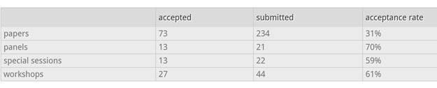
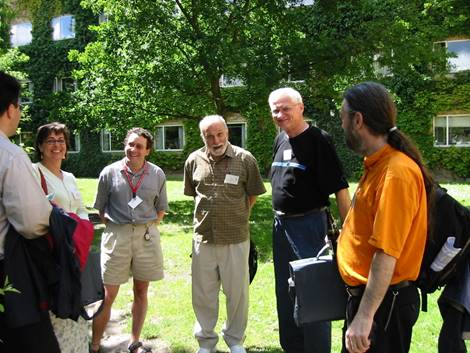
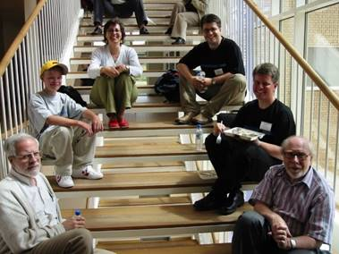
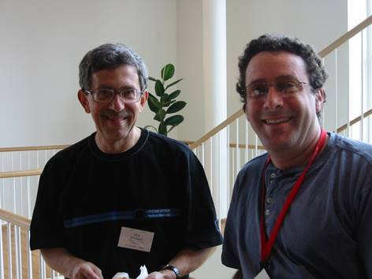

The [33rd Technical Symposium](http://www.math.grin.edu/~sigcse/2002/)
was held February 27 - March 3, 2002 in Northern Kentucky, Southern Side
of Cincinnati. The Conference Chairs were Judith Gersting (The
University of Hawaii at Hilo) and Renee McCauley (The University of
Charleston). The Program Chair was Scott Grissom (Grand Valley State
University).

Here are the conference submission statistics:\

This was the first year that the Technical Symposium broke 1000 in
attendees with 1110 attendees. The rest of the Conference Committee was:

Publications Editor: Deborah Knox (The College of New Jersey)\
Panels: Suzanne Westbrook (University of Arizona)\
Special Sessions: Angela Shiflet (Wofford College)\
Workshops: Douglas Harms (DePauw University)\
Registration: Carey Laxer & Frank Young (Rose-Hulman Institute of
Technology)\
Birds Of A Feather: Howard Whitston (Lawrence Tech University)\
Faculty Posters: Craig Wills (Worcester Polytechnic Institute)\
Student Activities: Linda Null (Penn State Harrisburg)\
Local Arrangements: Chuck Frank & Don Galli (Northern Kentucky
University), Karen Davis (University of Cincinnati), Joseph D. Oldham
(Georgetown College)\
Student Volunteers: Becky Rutherfoord (Southern Polytechnic State
University)\
Database Administrator: Henry Walker (Grinnell College)\
ACM International Student Research Contest: Ann Sobel (Miami University
of Ohio)\
Exhibits Liaison: Don Bailes (East Tennessee State University)\
Secondary School Liaison: Bill Fritz (Sycamore High School)\
Community College Liaison: Anne Applin (Pearl River Community College)\
Conference Liaison: Max Hailperin (Gustavus Adolphus College)\
Roommate Matching: Myles McNally (Alma College)\
International Liaison: Ricardo Jimenez Peris (Universidad Politecnica de
Madrid, Spain)\
First-Timer Activities: Wayne J. Staats (Stetson University)\
Evaluations: James Caristi (Valparasio University)\
Doctoral Consortium was run by Joseph Chase (Radford University) and
John Lewis (Villanova University).

The Outstanding Contribution to Computer Science Education Award was
given to **Elliot Soloway**, a pioneering Computer Science Education
researcher, master teacher, and eloquent spokesman for educational
reform involving computing to our computing colleagues and the world at
large.

The Lifetime Service to Computer Science Education was awarded to **A.
Joe Turner**, for his dedication to students, colleagues and the
profession both in the United States and abroad. He has been a Chair or
officer in: ACM, ACM Education Board, Curriculum \'91 Task Force,
Computer Science Accreditation Board, IFIP Working Group 3.2 (University
Informatics Education), National Educational Computing Association.

The [ITiCSE 2002](http://www.iticse2002.dk/iticse2002/home.shtml) in
Aarhus, DK7th ITiCSE conference was held June 24-26, 2002 at Aarhus
University in Aarhus, Denmark. Michael E. Caspersen (Aarhus University)
and Dan Joyce (Villanova University) were Conference Co-Chairs. Don
Goelman (Villanova University) and Ian Utting (University of Kent) were
Program Co-Chairs. There were over 100 papers submitted with 42 accepted
and 5 Working Groups. Here are pictures from Michael Caspersen.

**ITiCSE 2002 in Aarhus, DK**

\
Niklaus Wirth and Kristen Nygaard, two Turing Award Winners and keynote
speakers at ITiCSE 2002 (Kristen Nygaard passed away just six weeks
later).

\
Georgios Evangelidis, Maya Satratzemi, Mike Goldweber, Bruce Klein, Dick
Austing, and Ian Utting at ITiCSE 2002

\
Maya Satratzemi, Georgios Evangelidis, Christopher E. Caspersen, Michael
E. Caspersen, David Gries, and Niklaus Wirth at ITiCSE 2002

\
Don Goelman and Mike Goldweber at ITiCSE 2002