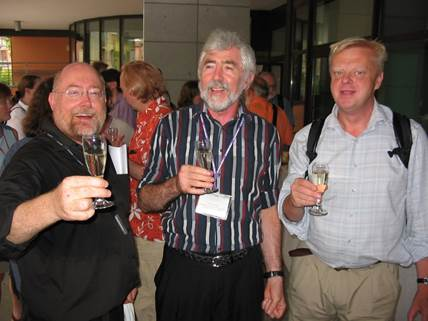
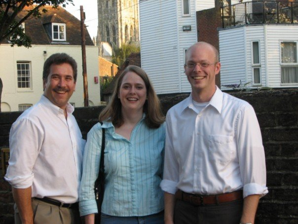

The 37th Technical Symposium was held March 1-5, 2006 in Houston, Texas.
The Conference Chairs were Douglas Baldwin (SUNY at Geneseo) and Paul
Tymann (Rochester Institute of Technology). The Program Chairs were
Susan Haller (SUNY Potsdam) and Ingrid Russell (University of Hartford).
294 papers submitted, with 104 accepted, for a 35% acceptance rate.
There were 1245 attendees (identical to previous year!)

The Outstanding Contribution to Computer Science Education Award was
given to **Richard Pattis** for more than two decades of innovation and
influence in providing thoughtful, profound, and concrete examples of
teaching and thinking about algorithmic problem solving and programming.

The Lifetime Service to Computer Science Education was awarded to
**Joyce Currie Little** in honor of her service on the SIGCSE Board, the
ACM Education Board, numerous conference committees; and for her
contributions to computing in two year colleges, to certification and to
professionalism in the discipline.

You can listen to an interview with Joyce through the Computing
Educators Oral History Project here:\
[http://ahab.southwestern.edu/departments/mathcompsci/OHProject/littleJC-\...](http://ahab.southwestern.edu/departments/mathcompsci/OHProject/littleJC-overview.html)

Here\'s a picture of the BlueJ and Greenfoot team at SIGCSE 2006: David
Barnes, Michael Kölling, Poul Henriksen, Bruce Quig, Davin McCall, John
Rosenberg, Matt Jadud, and Ian Utting:\

At the 2006 Symposium the first Roundtable for Department Chairs was
held on March 1st. Leading the effort were Sandra DeLoatch (Norfolk
State University), Sue Fitzgerald (Metropolitan State University), and
Frank Young (Rose-Hulman Institute of Technology).

SIGCSE and CSTA have worked to collaborate on areas of common interest.
For example, Robb Cutler, CSTA Chair, and Chris Stephenson, CSTA
Executive Director, gave the Friday keynote at SIGCSE 2006 on "Working
Together to Improve K-12 Computer Science Education".

The 9th Doctoral Consortium was held on March 1st co-located with the
Symposium. Leading the DC this year were Mark Guzdial (Georgia Institute
of Technology) and Orit Hazzan (Technion-Israel Institute of
Technology). Discussants included Richard Anderson (University of
Washington at Seattle), Philip East (University of Northern Iowa), and
Josh Tenenberg (University of Washington, Tacoma). From Cecily Heiner we
have a picture of the 2006 DC participants:\

The 11th ITiCSE was held June 26-28, 2006 at the University of Bologna,
Italy. Renzo Davoli (University of Bologna) was Conference Chair and
Paola Salomoni (University of Bologna) and Michael Goldweber (Xavier
University) served as Program Chairs. The conference had 195 submissions
with 59 acceptances (30% acceptance rate). There were 197 attendees and
6 Working Groups.

Here\'s a picture of Ray Lister, Tony Clear, and Anders Berklund at
ITiCSE 2006\

The 2nd ICER was held September 9-10, 2006 at the University of Kent in
Canterbury, UK. The Conference (and Program) Chairs were the initial
triumvirate of Richard Anderson (University of Washington), Sally
Fincher (University of Kent at Canterbury), and Mark Guzdial (Georgia
Institute of Technology). There were 23 papers submitted with 13
accepted for a 57% acceptance rate. There were 53 attendees that second
year.

Interestingly, the registration fee for ICER '06 included
accommodations, breakfast, morning tea, buffet lunch, afternoon tea, and
the conference dinner as well as the conference itself!

Here\'s a picture of Mark Guzdial, Allison Elliott Tew and Brian Dorn
enjoy ICER:\

An interesting tidbit on what the organization was up to during the
year:

-   During the spring (Northern Hemisphere), a new committee was formed:
    Committee on Models for Evaluating Faculty Scholarship. (Volume 38,
    Issue 2, June 2006 Inroads)
-   Plagiarism, including self-plagiarism was a big topic of Volume 38,
    Issue 4, December 2006 Inroads