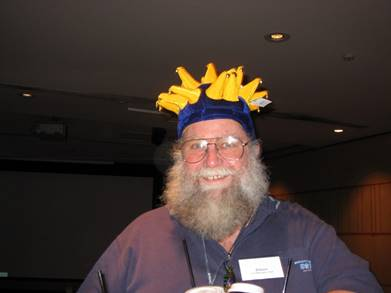

The 39th Technical Symposium held March 11-16, 2008 in Portland, OR, in
cooperation with SIGACCESS. This was the first SIGCSE to be held in the
Pacific Northwest! Conference Co-Chairs were Susan Rodger (Duke
University) and J.D. Dougherty (Haverford College). Program Chairs were
Sue Fitzgerald (Metropolitan University) and Mark Guzdial (Georgia
Institute of Technology). There were 332 papers submitted with 100
accepted for a 30.1% acceptance rate. There were 1229 attendees.

This year represents the beginning of the full proceedings in the
Digital Library, including a welcome message. The theme was "Diversity
through Accessibility" and it was the first year that Kids\' Camp was
part of the Technical Symposium. For the first time the proceedings were
available on CD.

The Outstanding Contribution to Computer Science Education Award was
given to **Randy Pausch**, for being an inspirational leader in building
programs and environments blending art with science and motivating a
world of learners to realize their dreams. His keynote was entitled,
\"Alice: A Dying Man\'s Passion\".

The Lifetime Service to Computer Science Education was awarded to
**Dennis J. Frailey**, for forty years of exceptional service in
industry and academia that stimulated a combined synergy which promoted
educational excellence in software engineering and computing education.

The other keynotes were delivered by Marissa Mayer of Google on Friday,
while Ed Lazowska of the University of Washington talked during the
concluding luncheon on Saturday.

The submission statistics for the entire Technical Symposium:\

The pictures from 2008 are still on the website
(<https://www2.cs.duke.edu/sigcse08/photos.html>). There are over 1000
pictures taken by the official photographer, Sandra, sister of Susan
Rodger!

There were several events co-located with the Symposium:

The 3rd Roundtable for Department Chairs was held on March 12, 2008. It
was led by Joyce Currie Little (Towson State University) and Frank Young
(Rose-Hulman Institute of Technology.

There were two Doctoral Consortiums held this year - one co-located with
the Symposium and the second co-located with ICER. The 11th Doctoral
Consortium was held on March 12, 2008 and was led by Josh Tenenberg
(University of Washington, Tacoma) and Donald Joyce (UNITEC Institute of
Technology). The discussants were Chris Hundhausen (Washington State
University), Laurie Murphy (Pacific Lutheran University), Carsten
Schulte (Freie Universität Berlin), and Beth Simon (University of
British Columbia).

The DC participants were Suzanne Balik (North Carolina State
University), Kristy Boyer (North Carolina State University), William
Doane (University at Albany), Brian Dorn (Georgia Institute of
Technology), Cecily Heiner (University of Utah), Michael Hewner (Georgia
Institute of Technology), Jeremy Huddleston (University of California,
Berkeley), Maria Knobelsdorf (Freie Universität Berlin), Eliana Medina
(University of Washington), Jeffrey Meunier (University of Connecticut),
Lijun Ni (Georgia Institute of Technology), Michael Orsega (University
of Tennessee), Michela Pedroni (ETH Zurich), Cecilia Vargas (University
of Kent), and Timothy Yuen (University of Texas at Austin).

The 13th ITiCSE conference was held June 30 - July 2, 2008 at
Universidad Politecnica de Madrid, Madrid, Spain. The conference Chair
was June Amillo (Universidad Politecnica de Madrid). The program
co-chairs were Ernestina Menasalvas and Raquel Martinez (both from
Universidad Politecnica de Madrid).

There were 150 papers submitted with 60 accepted for a 40% acceptance
rate. Dame Wendy Hall gave the opening keynote entitled \"What is web
science and why is it important?\" and 199 people attended. There were 5
working group reports.

The 4th ICER was held September 6-7, 2008 in Sydney, Australia. There
were 46 papers submitted with 16 accepted for a 35% acceptance rate and
52 people attended. The second triumvirate for ICER was Raymond Lister
(University of Technology Sydney), Michael Clancy (University of
California-Berkeley) and Michael Caspersen (Aarhus University). The
local person took care of all the arrangements when ICER was held at
their location, but all three were officially Conference Chairs and
Program Chairs (although you can find different names published in
different places).

Here are some pictures from ICER 2008:

\
Raymond Lister at ICER 2008\
\
Simon at ICER 2008\
\
Paul Denny and Raymond Lister at ICER 2008 (Paul Denny (on crutches)
being presented with the first Fool\'s Award, now known as the John
Henry Award)

The 12th Doctoral Consortium was held September 5, 2008 in Sydney when
the DC was relocated to be joint with ICER rather than the Technical
Symposium. The leaders of this DC were the same as earlier in the year:
Josh Tenenberg (University of Washington, Tacoma) and Donald Joyce
(UNITEC Institute of Technology). Thanks for doing double duty!

In Volume 40, Issue 2, June 2008 Inroads issue the discussion of
officially transitioning Inroads from "newsletter" to "magazine" began.
The Board proposed to: 1. Decouple the conference proceedings from
Inroads 2. Elevate Inroads to a \"magazine\" classification within ACM
3. Elevate the content to include papers of \"refereed\", \"formally
reviewed\", and \"reviewed\" status for all four quarterly issues. The
details were outlined in an email to the membership on March 13 and the
details were reprinted in the Peripherals section of this issue.

From the same issue, a new set of leaders for ICER were announced to
carry on the second 3-year host/leader cycle. Raymond Lister chaired
ICER '08 in Sydney, Australia. His co-chairs were Mike Clancy, the 2009
ICER chair, and Michael Caspersen, the 2010 chair.

Two international chapters of SIGCSE were launched this year -- an
Australasian chapter and a Spanish chapter.

From Inroads Volume 40, Issue 4, December 2008: The 2008 year saw us at
an all-time high for membership. JERIC transformed into a new
publication called Transactions on Computing Education.