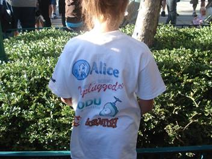
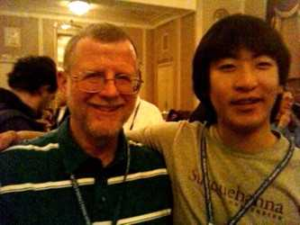
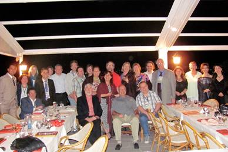

The year is 2010 and we elected another Board. Renee McCauley (College
of Charleston) was elected Chair and Dan Joyce (Villanova University)
was elected Vice-Chair. Secretary was Susan Rodger (Duke University) and
Treasurer was Doug Baldwin (State University of New York Geneseo). At
Large members elected were Tiffany Barnes (North Carolina State
University), Mark Guzdial (Georgia Institute of Technology) and Amber
Settle (Depaul University). Barbara Boucher Owens (Southwestern
University) continued as Past Chair. The Bulletin Editor was Henry
Walker (Grinnell University), assisted by Z Sweedyk (Harvey Mudd
College) and Christine Alvarado (University of California at San Diego).

The 41st Technical Symposium was held March 10-13,2010 in Milwaukee,
Wisconsin. The conference chairs were Gary Lewandowski (Xavier
University) and Steve Wolfman (University of British Columbia). Program
chairs were Thomas Cortina (Carnegie Mellon University) and Ellen Walker
(Hiram College).

From The Bulletin (Vol. 42, No. 1, June 2010), here is SIGCSE 2010 by
the numbers:

Participants

-   Attendees: 1176
-   SIGCSE Award Winners giving talks: 2
-   Exhibitors: 31
-   Platinum Plus Supporter: 1 (Microsoft)
-   Platinum Supporters: 2 (Google, Intel)
-   Gold Supporter: 1 (IBM)
-   Companies/organizations making inkind donations: 15

Submissions

-   Pre-symposium events (Wed.): 8
-   Papers: 303 submitted, 103 (34%) accepted
-   Panels: 24 submitted, 12 (50%) accepted
-   Special Sessions: 23 submitted, 12 (52%) accepted
-   Workshops: 86 submitted, 39 (45%) accepted
-   Posters: 88 submitted, 48 (55%) accepted
-   Birds of a Feather: 54 submitted, 36 (67%) accepted
-   Videos: 14 submitted, 11 (79%) accepted

Organization/Logistics/Technical Support

-   Committee members: 36
-   Number of reviewers: 777
-   Number of reviews received: 1667 + 303 meta-reviews
-   Number of reviews (including meta-reviews) assigned to each paper:
    at least 6

Here are some pictures of the Kids\' Camp T-shirts. Can anyone identify
the cute model?\
\
Girl showing back of Tshirt with Alice, CS Unplugged, Kodu and Scratch\
\
Girl in SIGCSE 2010 Kids Camp Tshirt

Here are a couple of pictures from Dan Joyce:\
\
Dan Joyce and son Tom\
\
Don Goelman, Pete DePasquale and Bob Beck

The 5th Roundtable for Department Chairs was held March 10, 2010 and was
led by Joyce Currie Little (Towson State University), Sandra DeLoatch
(Norfolk State University), Frank Friedman (Temple University), and
Dianne Martin (George Washington University)

The Outstanding Contribution to Computer Science Education Award was
given to **Sally Fincher**, for outstanding contributions to computing
education research and inspiring a generation of computing education
researchers.

The Lifetime Service to Computer Science Education was awarded to
**Peter J. Denning**, for forty years of exceptional service in industry
and academia that stimulated a combined synergy which promoted
educational excellence in software engineering and computing curricula.

ITiCSE\
The 15th ITiCSE conference was held June 26-30 at Bilkent, Ankara,
Turkey. Conference chairs were Reyan Ayfer, Bilkent University, Turkey
and John Impagliazzo, Qatar University, Qatar. The Program Chair was
Cary Laxer, Rose-Hulman Institute of Technology, USA. There were 117
paper submissions with 60 accepted (51.3% acceptance rate). There were
190 attendees and 8 working groups. The ITiCSE 2009 dinner was held on a
cruise boat on the river Seine and included Turkish dancing and
entertainment.

Program committee for ITICSE 2010 in Ankara, Turkey.\

More pictures can be found at the conference website:
<http://iticse2010.bilkent.edu.tr/>.

ICER\
The 6th ICER was held August 9-10, 2010 in Aarhus, Denmark. There was
another change in the leadership structure with the previous conference
chair staying as Past Chair, the current site, and the future site.
Again, the local person took care of the local arrangements, but
officially all three were conference and program chairs: Michael
Caspersen (University of Aarhus), Kathryn Sanders (Rhode Island College)
and Michael Clancy (University of California Berkeley). There were 38
papers submitted with 12 accepted (32% acceptance rate). There were 38
attendees.

From The Bulletin (Vol. 42, No. 3, September, 2010):\

Since 2008, the ICER Fool\'s Award has been given for the paper with the
most interesting idea and/or most potential for impact on CS education
and CS Education research. This year\'s winners were Orni
Meerbaum-Salant, Michal Armoni, and Mordechai (moti) Ben-Ari for their
paper Learning Computer Science Concepts with Scratch. Among other
things, the paper introduces the idea of integrating the SOLO taxonomy
and Bloom\'s taxonomy as orthogonal taxonomies. Most people in the
audience were captured by the idea, which seems very promising and
useful. Picture of author in viking hat with horns.

The 14th Doctoral Consortium was held on August 8th in Aarhus with Lauri
Malmi (Aalto University) leading the efforts.

The March 2010 (Volume 42, Issue 1) brought a new format to the Bulletin
- a newsletter format. Here\'s a snapshot of the SIGCSE membership from
the same issue (reported 14 January 2010):

-   2624 members
-   members from 63 countries
-   2069 (78.9%) from the United States
-   94 from Canada
-   62 from the United Kingdom
-   49 from Scandinavia (21 from Sweden)
-   33 from Spain
-   32 from Australia
-   24 from Japan
-   22 from Germany
-   10-20 from Greece, Ireland, Israel, New Zealand, South Africa,
    Taiwan and South Africa

Did you know that SIGCSE used to have several listservs? From The
Bulletin (Vol. 42, No. 2, June 2010) in addition to the two we have now
(SIGCSE-ANNOUNCE and SIGCSE-MEMBERS) we also had SIGCSE-COMMITTEES,
SIGCSE-MATH-COMM, SIGCSE-FACULTY-EVAL, SIGCSE-WOMEN-COMM and SIGCSE-CRM.
As use within each declined or the sub-committees finished their work
they were discontinued.