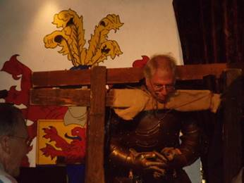
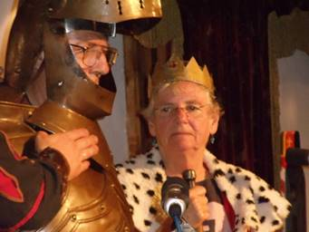
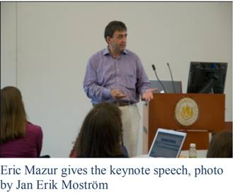

The 42nd Technical Symposium was held March 9-12, 2011 in Dallas, TX.
The Conference Co-Chairs were Thomas Cortina (Carnegie Mellon
University) and Ellen Walker (Hiram College). The Program Co-Chairs were
Laurie Smith King (College of the Holy Cross) and Dave Musicant
(Carleton College). There were 314 papers submitted with 107 accepted
(34% acceptance rate). There were 1187 attendees.

For the first time, a Best Paper Award was given; the winners were
Guillaume Marceau, Kathi Fisler, and Shriram Krishnamurthi for their
paper "Measuring the Effectiveness of Error Messages Designed for Novice
Programmers".\
\
Best Paper Award Winners Guillaume Marceau and Kathi Fisler with
Symposium Co-Chairs Ellen Walker and Tom Cortina.

And who can forget the \"Pokens!\"???\
\
And of course - the Robot Hoedown & Rodeo!\
\
Thanks to Robert Walker, you can find loads more pictures here:
[https://www.flickr.com/photos/robert\_a\_walker/sets/72157626236567140/wit\...](https://www.flickr.com/photos/robert_a_walker/sets/72157626236567140/with/5548479943/)\
The 6th Roundtable for Department Chairs was held on March 12, 2011 and
was led by Sandra DeLoatch (Norfolk State University), Frank Friedman
(Temple University), and Dianne Martin (George Washington University).

The conference theme was Reaching Out was reflected in Matthias
Felleisen\'s talk, \"Teach Scheme!\", Susan Landau\'s talk, \"A Computer
Scientist Goes to Washington: How to be Effective in a World Where Facts
Are Only 10% of the Equation,\" and Luis von Ahn\'s talk, \"Three Human
Computation Projects\" which received a rare standing ovation. In honor
of our Texas location, we added the \"Robot Hoedown and Rodeo\" with
\"trail bosses\" Jennie Kay and Tom Lauwers, featuring a grand finale of
40 line-dancing robots!

The Outstanding Contribution to Computer Science Education Award was
given to Matthias Felleisen for the creation of a design-focused
introductory curriculum, for educational outreach programs for K-12, and
for many PhD students who continue to merge programming language
research and education.

You can listen to an interview with Matthias through the Computing
Educators Oral History Project here:
[http://ahab.southwestern.edu/departments/mathcompsci/OHProject/felleisen\...](http://ahab.southwestern.edu/departments/mathcompsci/OHProject/felleisenM-overview.html).

The Lifetime Service to Computer Science Education was awarded to Gordon
Davies for many years of valuable and generous service to the computing
education community including contributions through active membership on
international committees, working groups, and conference program
committees.

You can listen to an interview with Gordon through the Computing
Educators Oral History Project here:
[http://ahab.southwestern.edu/departments/mathcompsci/OHProject/daviesG-o\...](http://ahab.southwestern.edu/departments/mathcompsci/OHProject/daviesG-overview.html).

The 16th ITiCSE conference was held June 25-29, 2011 in Darmstadt,
Germany. The conference co-chairs were Guido Rößling (TU Darmstadt) and
Christian Spannagel (PH Heidelberg). The Program Chair was Thomas L.
Naps (University of Wisconsin Oshkosh). There were 169 papers submitted
with 65 accepted for a 38.5% acceptance rate. There were 200 people in
attendance and 3 working groups.

The Wednesday night conference dinner was held at Castle Auerbach just
outside of Darmstadt and provided a real medieval knight's meal with
great fun and entertainment. It included a juggler and two musicians for
medieval music and entertainment. At the end, former SIGCSE chairs
Barbara Boucher Owens and Henry Walker were elevated to Queen Barbara
and Sir Henry, Grand Duke of Castle Auerbach, ending an enjoyable and
relaxed conference. (The Bulletin, Vol. 43, No. 3, September 2011).

For some images of ITiCSE 2011 (in Darmstadt) and the conference banquet
in an old castle, see
[http://www.cs.grinnell.edu/\~walker/personal-photos/iticse-darmstadt-2011\...](http://www.cs.grinnell.edu/~walker/personal-photos/iticse-darmstadt-2011/iticse-2011/iticse-skits.html)
(thanks to Henry and Terry Walker).

Dinner in the castle with musicians for entertainment.\
\
After dinner there were \"skits\". Featured prominently were Barb Owens
and Henry Walker:\

The 7th ICER conference was held August 8-9, 2011 in Providence, RI. In
charge of local arrangements was Kathryn Sanders (Rhode Island College).
The Conference Co-Chairs and Program Co-Chairs were Michael Caspersen
(Aarhus University), Kathryn Sanders (Rhode Island College), and Alison
Clear Young (Christchurch Polytechnic Institute of Technology). There
were 47 papers submitted with 18 accepted for a 38% acceptance rate.
There were 68 attendees. The keynote was given by Eric Mazur (Harvard
University):

\

The 15th Doctoral Consortium was held on August 7, 2011 with Robert
McCartney (University of Connecticut) and Judy Sheard (Monash
University) leading.

The Bulletin (Vol. 43, No. 2, June 2011) announced that each December,
beginning in 2011, a CD with proceedings from all the year\'s
conferences would be mailed to members. The Bulletin (Vol. 43, No. 4,
December 2011) announced a new publication schedule for The Bulletin:
The SIGCSE Bulletin will be published in the middle of the months of
October, January, April, and July.