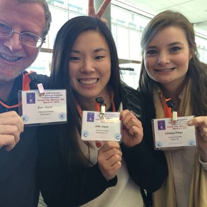
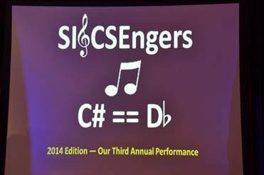
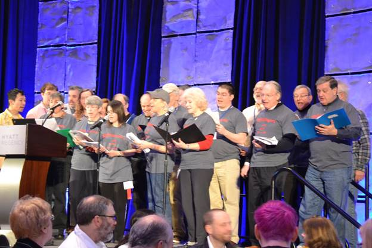
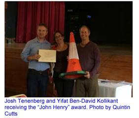

The 45th Technical Symposium was held March 5-8, 2014 in Atlanta,
Georgia. The Conference Co-Chairs were J. D. Dougherty (Haverford
College) and Kris Nagel (Georgia Gwinnett College). The Program
Co-Chairs were Adrienne Decker (Rochester Institute of Technology) and
Kurt Eiselt (University of British Columbia). There were 274 papers
submitted with 100 accepted (39.4% acceptance rate). There is some
discrepancy on the number of attendees, with the registration team
reporting 1383 and the website
([https://sigcse.org/sigcse/events/symposia/2014/](symposia/2014/index.html))
reporting 1285. Clarification anyone?

The Outstanding Contribution to Computer Science Education Award was
given to Robert Panoff for promoting student enrichment, curriculum
development, faculty enhancement, and infusing computational thinking at
all levels through Shodor and the National Computational Science
Institute.

The Lifetime Service to Computer Science Education was awarded to Andrea
Lawrence for dedication to the computing education community, serving as
a role model and mentor to students and faculty, improving diversity in
computing education, making computing education available to everyone,
and for helping students and faculty to \"Find a way or make one\". You
can listen to an interview with Andrea through the Computing Educators
Oral History Project here:
[http://ahab.southwestern.edu/departments/mathcompsci/OHProject/lawrenceA\...](http://ahab.southwestern.edu/departments/mathcompsci/OHProject/lawrenceA-overview.html).

The very first New Educators Workshop was held in conjunction with the
Technical Symposium on March 5, 2014 and was led by David Reed
(Creighton University) and Andrea Danyluk (Williams College). The SIGCSE
Board agreed to run this workshop every other year. This meant that the
Department Chair Roundtable and the New Educators Workshop would
alternate every year at SIGCSE.

\
Dan Joyce with his daughter Julie and another Villanova student Lindsey
Press holding their badges up to solve one of the SIGCSE puzzles for
that year

And now for a very special group - the SIGCSE CSEngers!!! The marvelous
Jesse Heines (University of Massachusetts, Lowell) organized volunteers
each year who practiced and then performed at the closing luncheon. It
was a guaranteed good time!\
\
\
\

The 19th ITiCSE conference was held June 23-25, 2014 in Uppsala, Sweden.
The Conference Co-Chairs were Asa Cajander and Mats Daniels (both from
Uppsala University). The Program Co-Chairs were Tony Clear (Auckland
University of Technology) and Arnold Pears (Uppsala University). There
were 150 papers submitted with 53 accepted (35% acceptance rate). There
were 3 working groups and 169 people in attendance.

The 10th ICER conference was held August 11-13, 2014 in Glasgow,
Scotland. Quintin Cutts (University of Glasgow) handled all of the local
arrangements. The Conference and Program Co-Chairs were Beth Simon
(University of California at San Diego), Quintin Cutts (University of
Glasgow), and Brian Dorn (University of Nebraska at Omaha). There were
69 papers submitted with 17 accepted for a 25% acceptance rate and 79
registered attendees.\
\
This ICER will forever be known as the \"dancing\" ICER as the
participants enjoyed a Scottish ceilidh dance following the conference
banquet. Much of the night\'s festivities were captured by the Google
Glasses worn by several of the students in attendance.\

The 18th Doctorial Consortium was held on August 10, 2014, co-located
with ICER. The leaders this year were Sally Fincher (University of Kent)
and Mark Guzdial (Georgia Institute of Technology).