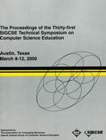



<!--  -->

**Publication Acceptance Rates**\
Papers, panels and special sessions are subject to a double blind review
process with over 1,600 reviews submitted online.

 <table class="table table-hover table-sm"><tbody><tr><th> </th>
<th>accepted</th>
<th>submitted</th>
<th>acceptance rate</th>
</tr><tr><td>papers</td>
<td>78</td>
<td>220</td>
<td>35%</td>
</tr><tr><td>panels</td>
<td>15</td>
<td>24</td>
<td>63%</td>
</tr><tr><td>seminars</td>
<td>6</td>
<td>10</td>
<td>60%</td>
</tr><tr><td>workshops</td>
<td>23</td>
<td>35</td>
<td>66%</td>
</tr></tbody></table>
**Links to Additional Information/Materials**

**Symposium Committee**

Symposium Chairs

-   Lillian \"Boots\" Cassel\
    Villanova University
-   Nell Dale\
    The University of Texas at Austin

Program Chair

-   Henry Walker\
    Grinnell College

Proceedings

-   Susan Haller\
    University of Wisconsin - Parkside

Panels

-   Ursula Wolz\
    The College of New Jersey

Seminars and Workshops

-   Deepak Kumar\
    Bryn Mawr College

Birds Of A Feather

-   Liz Adams\
    James Madison University

Faculty Posters

-   Dawn Cizmar\
    The University of Texas at Austin

Doctoral Consortium

-   Vicki Almstrum\
    The University of Texas at Austin
-   Marian Petre\
    The Open University

Student Research

-   Ann Sobel\
    Miami University

Exhibit Coordinator

-   Don Bailes\
    East Tennessee State University

Student Volunteers

-   John Lewis\
    Villanova University

Evaluation

-   Suzy Gallagher\
    The University of Texas at Austin

First Timers

-   Lisa Kaczmarczyk\
    The University of Texas at Austin

Treasurer

-   Dick Austing\
    Univ. of Maryland Univ. College, retired

Registration

-   Frank Young\
    Rose-Hulman Institute of Technology
-   Cary Laxer\
    Rose-Hulman Institute of Technology

Local Arrangements

-   Barbara B. Owens\
    Southwestern University

Non-US Liaison

-   Chris McDonald\
    University of Western Australia

Roommate Matching

-   Jim Aman\
    Columbus School for Girls
-   Jim FitzSimmons\
    Wilmington College

Industrial Liaison

-   Rich Brice\
    The University of Texas at Austin
