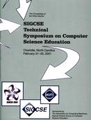



**Publication Acceptance Rates**\
Papers, panels and special sessions are subject to a double blind review
process with over 1,600 reviews submitted online.

<table class="table table-hover table-sm"><tbody><tr><th> </th>
<th>accepted</th>
<th>submitted</th>
<th>acceptance rate</th>
</tr><tr><td>papers</td>
<td> 78</td>
<td> 225</td>
<td> 35%</td>
</tr></tbody></table>

**Symposium Committee**

Symposium Chair

-   Henry Walker\
    Grinnell College

Program Co-Chairs

-   Judith Gersting\
    University of Hawaii at Hilo
-   Renee McCauley\
    The University of Charleston

Panels

-   Tim Long\
    Ohio State University

Special Sessions

-   Wanda Dann\
    Ithaca College
-   Chuck Leska\
    Ithaca College

Workshops

-   Lisa Meeden\
    Swarthmore College

Birds-of-a-Feather

-   Venu Dasigi\
    Southern Polytechnic State University

Faculty Posters

-   Judith Williams\
    William Penn University

ACM International Student Research Contest

-   Ann Sobel\
    Miami University

Town Meeting Moderator

-   Sue Fitzgerald\
    Metropolitan State University

Student Volunteers

-   Deborah Hwang\
    University of Evansville

Doctoral Consortium

-   John Lewis\
    Villanova University
-   Vicki Alumstrum\
    The University of Texas at Austin

Proceedings

-   Ingrid Russell\
    University of Hartford

Treasurer

-   Scott Grissom\
    Grand Valley State University

Local Arrangements

-   Kent Foster\
    Winthrop University
-   William Myers\
    Belmont Abbey College
-   Gireesh Gupta\
    Belmont Abbey College
-   Robert Lover\
    Belmont Abbey College
-   William Davis\
    Belmont Abbey College

Exhibits Liaison

-   Don Bailes\
    East Tennessee State University

Exhibits Floor Manager

-   Tom D\'Auria\
    Information Methods Incorporated

Firswt-Timer Activities

-   Elizabeth Johnson\
    Xavier University

Northern European Liaison

-   Jurgen Borstler\
    Umea University\
    Sweden

Southern European Liaison

-   Ricardo Jimenez Peris\
    Universidad Politecnica de Madrid\
    Spain

Asian/Australian Liaison

-   Tony Greening\
    The University of Sydney\
    Australia

Community College Liaison

-   Donna Tupper\
    Community College of Baltimore County

Secondary School Liaisons

-   Sarah Fix\
    Winston-Salem Forsyth County Schools
-   Rich Kick\
    Hinsdale Central High School

Registration

-   Carey Laxer\
    Rose-Hulman Institute of Technology
-   Frank Young\
    Rose-Hulman Institute of Technology

Roommate Matching

-   Cathy Baresis\
    Olivet Nazarene University

Evaluation

-   William Marion\
    Valparaiso University
