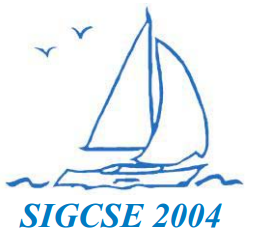



<!-- 
 -->

**Publication Acceptance Rates**

 <table class="table table-hover table-sm"><tbody><tr><th> </th>
<th>accepted</th>
<th>submitted</th>
<th>acceptance rate</th>
</tr><tr><td>papers</td>
<td>90</td>
<td>320</td>
<td>28%</td>
</tr><tr><td>panels</td>
<td>11</td>
<td>16</td>
<td>69%</td>
</tr><tr><td>special sessions</td>
<td>16</td>
<td>21</td>
<td>76%</td>
</tr><tr><td>workshops</td>
<td>31</td>
<td>64</td>
<td>48%</td>
</tr><tr><td>faculty posters</td>
<td>40</td>
<td>58</td>
<td>69%</td>
</tr></tbody></table>

**Key Notes**

-   Owen Astrachan: Everything I Needed to Know about Programming and
    Computer Science I Learned from my Teachers
-   Peter Denning: [Great Principles in Computing
    Curricula](http://dl.acm.org/citation.cfm?id=971303&CFID=442642152&CFTOKEN=40656014)
-   Gene Spafford: [What \*is\* Information
    Security?](http://dl.acm.org/citation.cfm?id=971304&CFID=442642152&CFTOKEN=40656014)

**Symposium Committee**

Symposium Chairs

-   Dan Joyce - Villanova University
-   Deborah Knox - The College of New Jersey

Program Chairs

-   Wanda Dann - Ithaca College
-   Tom Naps - University of Wisconsin - Oshkosh

Panels and Special Sessions

-   Myles McNally - Alma College

Workshops

-   Greg Wolffe - Grand Valley State University

Publications

-   Douglas Harms - DePauw University

Registration

-   Cary Laxer and Larry Merkle - Rose-Hulman Institute of Technology

Faculty Posters

-   Kris Powers - Berry College

Birds Of A Feather

-   Jim Howatt - Southeastern Louisiana University

Student Volunteers and Student Activities

-   Jim Aman - Columbus School for Girls

Treasurer

-   John Lewis - Villanova University

Database Administrators

-   Henry Walker - Grinnell College
-   John Dooley - Knox College

Evaluations

-   Paul Tymann - Rochester Institute of Technology

Local Arrangements

-   George Harrison - Norfolk State University

Doctoral Consortium

-   Sue Fitzgerald - Metropolitan State University
-   K. Todd Stevens - Radford University

ACM International Student Research Contest

-   Ann Sobel - Miami University of Ohio
