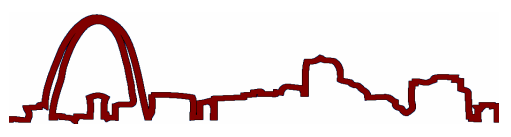



<!-- 
 -->

**Publication Acceptance Rates**

 <table class="table table-hover table-sm"><tbody><tr><th> </th>
<th>accepted</th>
<th>submitted</th>
<th>acceptance rate</th>
</tr><tr><td>papers</td>
<td>104</td>
<td>330</td>
<td>32%</td>
</tr><tr><td>panels</td>
<td>10</td>
<td>21</td>
<td>48%</td>
</tr><tr><td>special sessions</td>
<td>14</td>
<td>24</td>
<td>58%</td>
</tr><tr><td>workshops</td>
<td>37</td>
<td>57</td>
<td>65%</td>
</tr><tr><td>faculty posters</td>
<td>49</td>
<td>51</td>
<td>96%</td>
</tr></tbody></table>

**Key Notes**

-   Kim Bruce: [Using Abstractions to Make Concepts
    Concrete](http://dl.acm.org/citation.cfm?id=1047347&CFID=442642152&CFTOKEN=40656014)
-   Mordechai Ben-Ari: [The Concorde Doesn\'t Fly
    Anymore](http://dl.acm.org/citation.cfm?id=1047354&CFID=442642152&CFTOKEN=40656014)
-   Maria Klawe: [Increasing the Number of Women Majoring in Computer
    Science: What
    Works?](http://dl.acm.org/citation.cfm?id=1047346&CFID=442642152&CFTOKEN=40656014)

**Symposium Committee**

Symposium Chairs

-   Wanda Dann - Ithaca College
-   Tom Naps - University of Wisconsin - Oshkosh

Program Chairs

-   Douglas Baldwin - SUNY at Geneseo
-   Paul Tymann - Rochester Institute of Technology

Panels and Special Sessions

-   Susan Rodger - Duke University

Workshops

-   Myles McNally - Alma College

Publications

-   John Dougherty - Haverford College

Registration

-   Cary Laxer, Frank Young, and Larry Merkle - Rose-Hulman Institute of
    Technology

Faculty Posters

-   Bonnie McVey - St. Norbert College

Birds Of A Feather

-   Don Goelman - Villanova University

Student Volunteers and Student Activities

-   Pam Lawhead - University of Mississippi
-   Constance Bland - University of Mississippi

Treasurer

-   Scott Grissom - Grand Valley State University

Database Administrators

-   Henry Walker - Grinnell College
-   John Dooley - Knox College

Evaluations

-   Cathy Bareiss - Olivet Nazarene University

K-12 Liaison

-   Rick Kick - Hinsdale Central High, Illinois

International Liaison

-   Guido Rößling - Darmstadt Univ of Technology

Local Arrangements

-   Dennis Bouvier - St. Louis University

Doctoral Consortium

-   Mark Guzdial - Georgia Institute of Technology
-   K. Todd Stevens - Radford University

ACM International Student Research Contest

-   Ann Sobel - Miami University of Ohio
