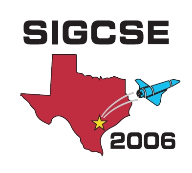



<!-- 
 -->

**Publication Acceptance Rates**

 <table class="table table-hover table-sm"><tbody><tr><th> </th>
<th>accepted</th>
<th>submitted</th>
<th>acceptance rate</th>
</tr><tr><td>papers</td>
<td>104</td>
<td>294</td>
<td>35%</td>
</tr><tr><td>panels</td>
<td> 15</td>
<td> 26</td>
<td> 58%</td>
</tr><tr><td>special sessions</td>
<td> 10</td>
<td> 28</td>
<td> 36%</td>
</tr><tr><td>workshops</td>
<td> 37</td>
<td> 50</td>
<td> 74%</td>
</tr></tbody></table>

**Key Notes**

-   Richsrd Pattis: [Can\'t sing, can\'t act, can dance a little: (on
    choosing the right dancing
    partners)](http://dl.acm.org/citation.cfm?id=1121343&CFID=442642152&CFTOKEN=40656014)
-   Robb Cutler, Chris Stephenson: [Working Together to Improve K-12
    Computer Science
    Education](http://dl.acm.org/citation.cfm?id=1121344&CFID=442642152&CFTOKEN=40656014)
-   Bill LaBarge: [Make it Look real, make it look
    cool](http://dl.acm.org/citation.cfm?id=1121342&CFID=442642152&CFTOKEN=40656014)

**Symposium Committee**

Symposium Chairs

-   Douglas Baldwin - SUNY at Geneseo
-   Paul Tymann - Rochester Institute of Technology

Program Chairs

-   Ingrid Russell - University of Hartford
-   Susan Haller - SUNY Potsdam

Panels and Special Sessions

-   John Dougherty - Haverford College

Workshops

-   Nancy Kinnersley - University of Kansas

Publications Chair

-   Michael Schneider - Macalester College

Registration

-   Cary Laxer, Larry Merkle and Lynn Degler - Rose-Hulman Institute of
    Technology

Faculty Posters

-   Dick Brown - St. Olaf College

Birds Of A Feather

-   Deb Burhans - Canisius College

Student Volunteers

-   Lisa Kaczmarczyk - Rose-Hulman Institute of Technology
-   Pam Lawhead - University of Mississippi
-   Steve Wolfman - University of British Columbia

Treasurer

-   Rodney Tosten - Gettysburg College

Database Administrators

-   Henry Walker - Grinnell College
-   John Dooley - Knox College

Evaluations

-   Laurie King - Holy Cross

K-12 Liaison

-   Rick Kick - Hinsdale Central High, Illinois

International Liaison

-   Guido Rößling - Darmstadt Univ of Technology
-   Alison Young - Unitec New Zealand

Local Arrangements

-   Dung \"Zung\" Nguyen - Rice University
-   Stephen Wong - Rice University

Doctoral Consortium

-   Mark Guzdial - Georgia Institute of Technology
-   Orit Hazzan - Israel Institute of Technology

ACM International Student Research Contest

-   Ann Sobel - Miami University of Ohio
