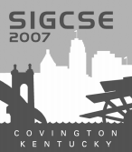



**Publication Acceptance Rates**

 <table class="table table-hover table-sm"><tbody><tr><th> </th>
<th>accepted</th>
<th>submitted</th>
<th>acceptance rate</th>
</tr><tr><td>papers</td>
<td>108</td>
<td>316</td>
<td>34%</td>
</tr><tr><td>panels</td>
<td> 7</td>
<td> 15</td>
<td> 47%</td>
</tr><tr><td>special sessions</td>
<td> 16</td>
<td> 25</td>
<td> 64%</td>
</tr><tr><td>workshops</td>
<td> 35</td>
<td> 65</td>
<td> 54%</td>
</tr></tbody></table>

**Key Notes**

-   Judith Gal-Ezer: [To teach is to touch lives
    forever](http://dl.acm.org/citation.cfm?id=1227312&CFID=442642152&CFTOKEN=40656014)
-   Grady Booch: [Readn\', writ\'n, \'rithmetic\...and
    code\'n](http://dl.acm.org/citation.cfm?id=1227380&CFID=442642152&CFTOKEN=40656014)
-   Jonathan Schaeffer: [The games computers play\...:
    perfectly](http://dl.acm.org/citation.cfm?id=1227503&CFID=442642152&CFTOKEN=40656014)

**Symposium Committee**

Symposium Chairs

-   Ingrid Russell - University of Hartford
-   Susan Haller - SUNY Potsdam

Program Chairs

-   J.D. Dougherty - Haverford College
-   Susan Rodger - Duke University

Panels and Special Sessions

-   Andrea Danyluk - Williams College

Workshops

-   Nancy Kinnsersley - University of Kansas

Publications

-   Gary Lewandowski - Xavier University

Registration

-   Cary Laxer, Larry Merkle and Lynn Degler - Rose-Hulman Institute of
    Technology

Posters

-   Sue Fitzgerald - Metropolitan State University

Birds Of A Feather

-   Bina Ramamurthy - University at Buffalo (SUNY)

Student Volunteers and Student Activities

-   Tom Cortina - Carnegie Mellon University
-   Dave Musicant - Carleton College

Treasurer

-   Scott McElfresh - Carnegie Mellon University

Database Administrators

-   Henry Walker - Grinnell College
-   John Dooley - Knox College

Evaluations

-   Dick Brown - St. Olaf College

K-12 Liaison

-   Leigh Ann Sudol - Fox Lane High School

International Liaison

-   June Amillo - Universidad Politécnica de Madrid

Local Arrangements

-   Charles E. Frank - Northern Kentucky University
-   Joe Oldham - Centre College

Doctoral Consortium

-   Orit Hazzan - Israel Institute of Technology
-   Josh Tenenberg - University of Washington, Tacoma

Workshop for Department Chairs

-   Frank Young - Rose-Hulman Institute of Technology

ACM International Student Research Contest

-   Ann Sobel - Miami University of Ohio
