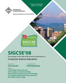
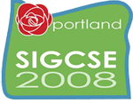



**Publication Acceptance Rates**

 <table class="table table-hover table-sm"><tbody><tr><th> </th>
<th>accepted</th>
<th>submitted</th>
<th>acceptance rate</th>
</tr><tr><td>papers</td>
<td> 100</td>
<td> 324</td>
<td> 31%</td>
</tr><tr><td>panels/special sessions</td>
<td> 24</td>
<td> 51</td>
<td> 47%</td>
</tr><tr><td>workshop</td>
<td> 38</td>
<td> 75</td>
<td> 51%</td>
</tr><tr><td>posters</td>
<td> 56</td>
<td> 75</td>
<td> 75%</td>
</tr><tr><td>birds of a feather</td>
<td> 36</td>
<td> 43</td>
<td> 84%</td>
</tr></tbody></table>

**Key Notes**

-   Randy Pausch: [Alice: A Dying Man\'s
    Passion](http://dl.acm.org/citation.cfm?id=1352137&CFID=442642152&CFTOKEN=40656014)
-   Marissa Mayer: [Innovation, Design, and Simplicity at
    Google](http://dl.acm.org/citation.cfm?id=1352205&CFID=442642152&CFTOKEN=40656014)
-   Ed Lazowska: [Computer Science: Past, Present, and
    Future](http://dl.acm.org/citation.cfm?id=1352321&CFID=442642152&CFTOKEN=40656014)

**Symposium Committee**

Symposium Chairs

-   Susan Rodger - Duke University
-   John Dougherty - Haverford College

Program Chairs

-   Mark Guzdial - Georgia Institute of Technology
-   Sue Fitzgerald - Metropolitan State University

Panels and Special Sessions

-   Lisa Meeden - Swarthmore College

Workshops

-   Steven Wolfman - University of British Columbia

Publications Editor

-   Ellen Walker - Hiram College

Registration

-   Cary Laxer, Larry Merkle and Lynn Degler - Rose-Hulman Institute of
    Technology

Posters

-   Lisa Kaczmarczyk - University of California

Birds Of A Feather

-   Tom Cortina - Carnegie Mellon University

Student Volunteers and Student Activities

-   Dan Garcia - University of California at Berkeley
-   Jeff Forbes - Duke University

Treasurer

-   Scott Grissom - Grand Valley State University

Database Administrators

-   Henry Walker - Grinnell College
-   John Dooley - Knox College

Evaluations

-   Carl Alphonce - University of Buffalo, SUNY

Childcare/Camp Arrangements

-   Pam Cutter - Kalamazoo College

K-12 Liaison

-   Don Kirkwood - North Salem High School

International Liaison

-   Tony Clear - Auckland University of Technology

Local Arrangements

-   Tammy VanDeGrift - University of Portland

Doctoral Consortium

-   Josh Tenenberg - University of Washington, Tacoma
-   Donald Joyce - Unitec, New Zealand

Roundtable for Department Chairs

-   Frank Young - Rose-Hulman Institute of Technology

Student Research Competition

-   Ann Sobel - Miami University
