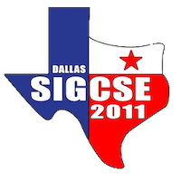



<!-- 
 -->

**Publication Acceptance Rates**

 <table class="table table-hover table-sm"><tbody><tr><th></th>
<th>accepted</th>
<th>submitted</th>
<th>acceptance rate</th>
</tr><tr><td>papers</td>
<td> 107</td>
<td> 315</td>
<td> 34%</td>
</tr><tr><td>panels/special sessions</td>
<td> 22</td>
<td> 38</td>
<td> 58%</td>
</tr><tr><td>workshops</td>
<td> 35</td>
<td> 78</td>
<td> 45%</td>
</tr><tr><td>posters</td>
<td> 48</td>
<td> 66</td>
<td> 73%</td>
</tr><tr><td>birds of a feather</td>
<td> 36</td>
<td> 48</td>
<td> 75%</td>
</tr><tr><td>videos</td>
<td> 7</td>
<td> 10</td>
<td> 70%</td>
</tr></tbody></table>

**Key Notes**

-   Matthias Felleisen: [Teach
    Scheme](http://dl.acm.org/citation.cfm?id=1953165&CFID=377150186&CFTOKEN=62886619)
-   Susan Landau: [A Computer Scientist Goes To Washington: How To Be
    Effective In A World Where Facts Are 10% Of The
    Equation](http://dl.acm.org/citation.cfm?id=1953233&CFID=377150186&CFTOKEN=62886619)
-   Luis von Ahn: [Three Human Computation
    Projects](http://dl.acm.org/citation.cfm?id=1953354&CFID=377150186&CFTOKEN=62886619)

**Best Paper**

-   Kathi Fisler, Guillaume Marceau, Shriram Krishnamurthi: [Measuring
    the Effectiveness of Error Messages Designed for Novice
    Programmers.](http://dl.acm.org/citation.cfm?id=1953163.1953308&coll=DL&dl=GUIDE&CFID=259270906&CFTOKEN=34763414)

**Symposium Committee**

Symposium Chairs

-   Thomas Cortina - Carnegie Mellon University
-   Ellen Walker - Hiram College

Program Chairs

-   Laurie Smith King - College of the Holy Cross
-   Dave Musicant - Carleton College

Panels and Special Sessions

-   Pam Cutter - Kalamazoo College

Workshops

-   Ruth E. Anderson - University of Washington
-   Adrienne Decker - University at Buffalo (SUNY)

Publications

-   Lester I. McCann - The University of Arizona

Registration

-   Cary Laxer and Lynn Degler - Rose-Hulman Institute of Technology
-   Larry Merkle - Wright State University

Posters

-   Tzu-Yi Chen - Pomona College

Birds of a Feather

-   Deborah Hwang - University of Evansville

Videos Coordinator

-   Dennis Bouvier - Southern Illinois University - Edwardsville

Student Volunteers and Student Activities

-   Brianna Morrison - Southern Polytechnic State University
-   Mary Anne Egan - Siena College

Treasurer

-   Scott Grissom - Grand Valley State University

Database Administrators

-   Henry Walker - Grinnell College
-   John Dooley - Knox College

Webmaster

-   Michael T. Helmick - Google

Evaluations

-   Kurt Eiselt - University of British Columbia

Kids\' Camp

-   Kimberly Voll - University of British Columbia
-   RoxAnn Stalvey - College of Charleston

Support/Exhibitor Liaison

-   Susan Rodger - Duke University

K-12 Liaisons

-   Stacey Armstrong - Cypress Woods High School
-   Judy Hromcik - Arlington High School

International Liaison

-   Tim Bell - University of Canterbury

Pre-Conference Event Liaison

-   Kristine Nagel - Georgia Gwinnett College

Local Arrangements

-   Jian Zhang - Texas Women\'s University

Student Research Competition

-   Ann Sobel - Miami University (Ohio)
