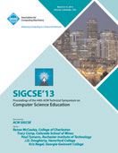
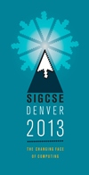



<!-- 
 -->

**Publication Acceptance Rates**

 <table class="table table-hover table-sm"><tbody><tr><th></th>
<th>accepted</th>
<th>submitted</th>
<th>acceptance rate</th>
</tr><tr><td>papers</td>
<td> 111</td>
<td> 293</td>
<td> 38%</td>
</tr><tr><td>panels</td>
<td> 11</td>
<td> 23</td>
<td> 48%</td>
</tr><tr><td>special sessions</td>
<td> 16</td>
<td> 23</td>
<td> 70%</td>
</tr><tr><td>workshops</td>
<td> 35</td>
<td> 84</td>
<td> 42%</td>
</tr><tr><td>posters</td>
<td> 52</td>
<td> 103</td>
<td> 51%</td>
</tr><tr><td>birds of a feather</td>
<td> 36</td>
<td> 49</td>
<td> 74%</td>
</tr></tbody></table>

**Key Notes**

-   Ed Lazowska, Bobby Schnabel, Mary Lou Soffa, Lucy Sanders, Jan Cuny,
    Patty Lopez, Juan Gilbert: [The Changing Face of
    Computing](http://dl.acm.org/citation.cfm?id=2445198&CFID=442642152&CFTOKEN=40656014)
-   John Etchemendy: [Online
    Education](http://dl.acm.org/citation.cfm?id=2445201&CFID=442642152&CFTOKEN=40656014)
-   Michael Kölling: [This much I know: thoughts on the past, present
    and future of educational programming
    tools](http://dl.acm.org/citation.cfm?id=2445200&CFID=442642152&CFTOKEN=40656014)
-   Jane Margolis: [Unlocking the clubhouse: a decade later and now
    what?](http://dl.acm.org/citation.cfm?id=2445202&CFID=442642152&CFTOKEN=40656014)

**Best Paper**

-   Leo Porter, Beth Simon: [Retaining nearly one-third more majors with
    a trio of instructional best practices in
    CS1.](http://dl.acm.org/citation.cfm?id=2445196.2445248&coll=DL&dl=GUIDE)

**Symposium Committee**

Symposium Chairs

-   Tracy Camp - Colorado School of Mines
-   Paul Tymann - Rochester Institute of Technology

Program Chairs

-   J.D. Dougherty - Haverford College
-   Kris Nagel - Georgia Gwinnett College

Panels and Special Sessions

-   Sue Fitzgerald - Metropolitan State University

Workshops

-   Susan Haller - SUNY Potsdam
-   Lester I. McCann - The University of Arizona

Publications

-   Joel Adams - Calvin College

Registration

-   Cary Laxer and Lynn Degler - Rose-Hulman Institute of Technology
-   Larry Merkle - Wright State University

Posters

-   Jodi Tims - Baldwin Wallace University

Birds of a Feather

-   Jian Zhang - Texas Woman\'s University

Student Volunteers and Student Activities

-   Steven Huss-Lederman - Beloit CollegeBrianna
-   Steven Wolfman - University of British Columbia

Access Services Coordinator

-   Mark Wambach - Rochester Institute of Technology

Treasurer

-   Scott Grissom - Grand Valley State University

Database Administrators

-   Henry Walker - Grinnell College
-   John Dooley - Knox College

Webmaster

-   Dan Bogaard - Rochester Institute of Technology
-   Steve Zilora - Rochester Institute of Technology

Evaluations

-   James Early - SUNY Oswego

Kids\' Camp

-   Susan Fox - Macalester College
-   James Maher - Colorado School of Mines

Publicity/Social Media

-   Kimberly Voll - Centre for Digital Media

Support/Exhibitor Liaison

-   Susan Rodger - Duke University

K-12 Liaisons

-   Marilyn Cadenhead - School of Science and Engr. Magnet
-   Ria Galanos - Thomas Jefferson High School for Science and Tech.

International Liaison

-   Catherine Lang - Swinburne University of Technology

Pre-Conference Event Liaison

-   Adrienne Decker - Rochester Institute of Technology

Local Arrangements

-   Jody Paul - Metropolitan State University of Denver

Affiliated Events Liaison

-   Sarah Heckman - North Carolina State University

Student Research Competition

-   Ann Sobel - Miami University (Ohio)
