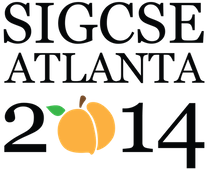



**Publication Acceptance Rates**

 <table class="table table-hover table-sm"><tbody><tr><th></th>
<th>accepted</th>
<th>submitted</th>
<th>acceptance rate</th>
</tr><tr><td>papers</td>
<td> 108</td>
<td> 274</td>
<td> 39%</td>
</tr><tr><td>panels</td>
<td> 14</td>
<td> 23</td>
<td> 61%</td>
</tr><tr><td>special sessions</td>
<td> 12</td>
<td> 16</td>
<td> 75%</td>
</tr><tr><td>workshops</td>
<td> 35</td>
<td> 75</td>
<td> 49%</td>
</tr><tr><td>posters</td>
<td> 56</td>
<td> 122</td>
<td> 46%</td>
</tr><tr><td>birds of a feather</td>
<td> 37</td>
<td> 52</td>
<td> 71%</td>
</tr></tbody></table>

**Key Notes**

-   Robert Panoff: [Computational Thinking for All: the Power and the
    Peril](http://dl.acm.org/citation.cfm?id=2554795&CFID=442642152&CFTOKEN=40656014)
-   Hadi Partovi: [Transforming US Education with Computer
    Science](http://dl.acm.org/citation.cfm?id=2554793&CFID=442642152&CFTOKEN=40656014)
-   AJ Bernheim Brush: [Lab of Things: a Devices Teaching and Research
    Platform for Home and
    Beyond](http://dl.acm.org/citation.cfm?id=2554794&CFID=442642152&CFTOKEN=40656014)

**Best Paper**

-   Claudia Szabo: [Student Projects Are Not Throwaways: Teaching
    Practical Software Maintenance in a Software Engineering
    Course.](http://dl.acm.org/citation.cfm?id=2538965&CFID=442642152&CFTOKEN=40656014)

**Symposium Committee**

Symposium Chairs

-   J.D. Dougherty - Haverford College
-   Kris Nagel - Georgia Gwinnett College

Program Chairs

-   Adrienne Decker - Rochester Institute of Technology
-   Kurt Eiselt - University of British Columbia

Panels and Special Sessions

-   Stephen Cooper - Stanford University

Workshops

-   Susan Haller - SUNY Potsdam
-   Paul Carter - University of British Columbia

Registration

-   Cary Laxer and Lynn Degler - Rose-Hulman Institute of Technology
-   Larry Merkle - Wright State University

Posters

-   Michael T. Helmick - University of Cincinnati

Birds of a Feather

-   Marc Rubin - Colorado School of Mines

Student Volunteers and Student Activities

-   Steven Wolfman - University of British Columbia
-   Pam Cutter - Kalamazoo College
-   Sara Melnick - Bronx Academy for Software Engineering

Accessibility

-   Raghuram Ramanujan - Davidson College

Treasurer

-   Scott McElfresh - Longwood University

Database Administrators

-   Henry Walker - Grinnell College
-   John Dooley - Knox College

Webmaster

-   Kimberly Voll - Centre for Digital Media
-   Michael T. Helmick - University of Cincinnati

Evaluations

-   Carl Alphonce - University at Buffalo

Kids\' Camp

-   James Maher - Colorado School of Mines
-   Cheryl Seals - Auburn University

Publicity/Social Media

-   Jamie Spacco - Knox College

Support/Exhibitor Liaison

-   Susan Rodger - Duke University
-   Tom Cortina - Carnegie Mellon

K-12 Liaisons

-   Crystal Furman - Brookwood High School

International Liaison

-   Annemieke Craig - Deakin University

Pre-Conference Event Liaison

-   Mary Anne Egan - Siena College

Local Arrangements

-   Deepa Muralidhar - North Gwinnett High School

Student Research Competition

-   Ann Sobel - Miami University (Ohio)
