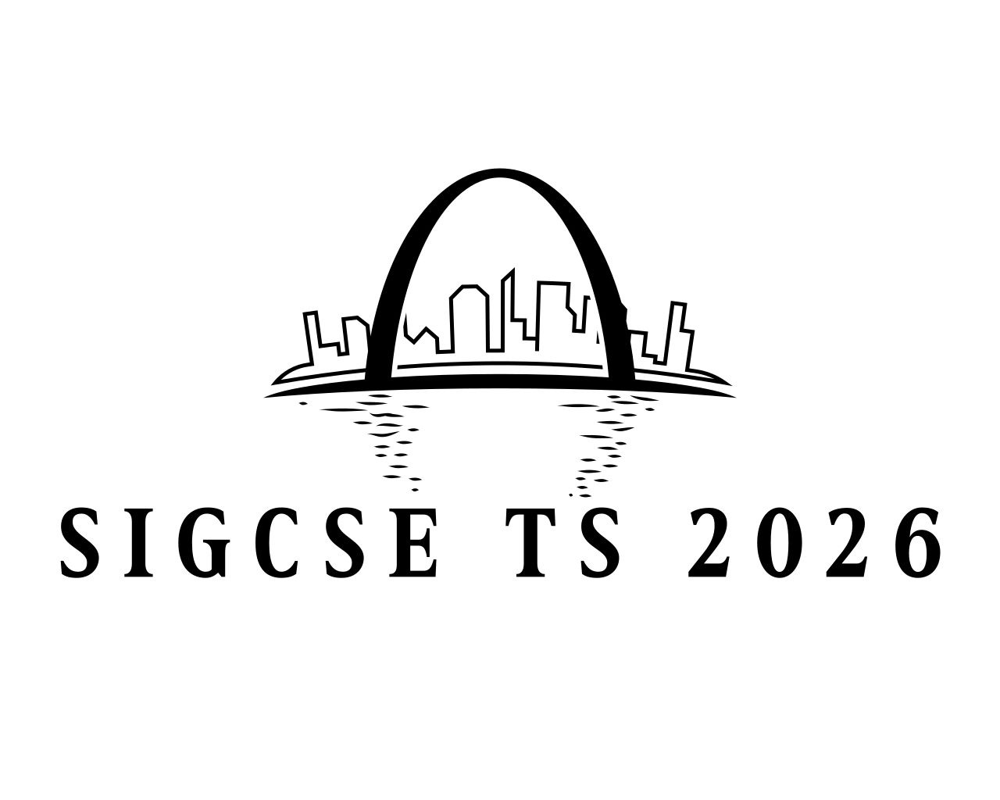

&nbsp;

<h3>Call For Participation</h3>

&nbsp;

The 57th ACM Technical Symposium on Computer Science Education will take place on February 18–21, 2026 in 
St. Louis, Missouri.

#### Important Dates

* **Thursday, June 26, 2025**: Paper Abstracts
* **Thursday, July 3, 2025**: Affiliated Events, Full Papers, Panels, Special Sessions,Tutorials
* **Thursday, October 2, 2025**: ACM SRC, BoFs, Demos, Lightning Talks, Nifty Assignments, Posters, Doctoral Consortium

Download the full [call for participation from here](SIGCSETS2026CFP.pdf).

